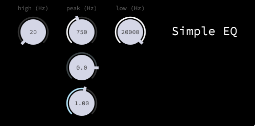

## Sound Tech Project

A simple EQ built using the JUCE Framework.

### Installation

You can open the project using the JUCER App, provided by the JUCE project.
From there, just follow the build instructions for your specific platform.
